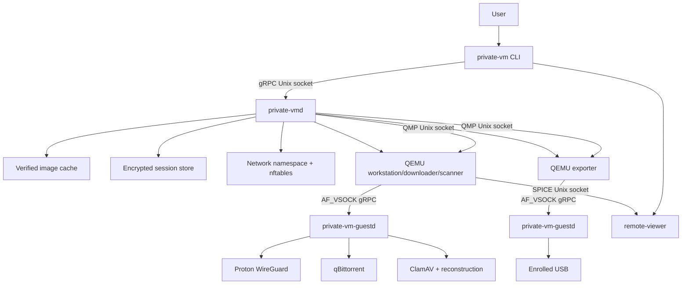
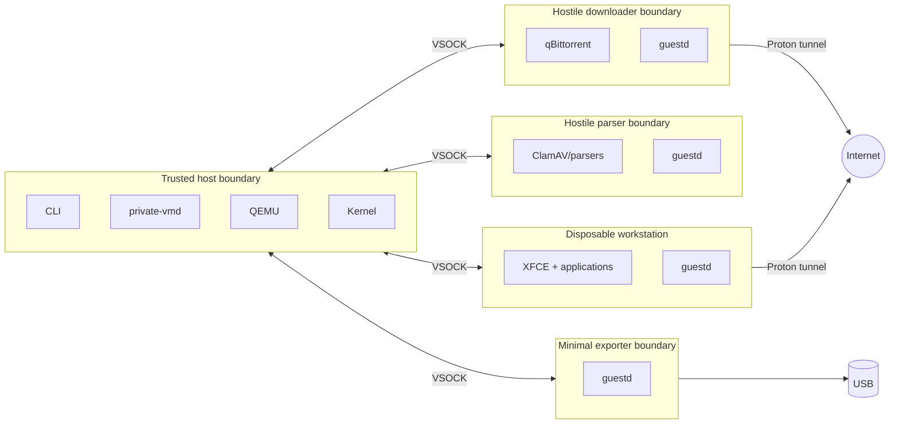

# System architecture

## Component diagram



## Trust boundaries



## Runtime resource ownership

One `Session` object owns:

- session ID and invoking UID
- role workflow and state
- session token
- VSOCK CIDs
- QEMU PIDs and pidfds
- QMP sockets
- SPICE sockets
- network namespaces
- TAP/veth names
- nftables table/chain handles
- outer LUKS container and device mapping
- root overlays
- quarantine image
- USB claim
- cancellation context
- ephemeral event/report store

No resource may exist without a parent session record. Cleanup is idempotent and
walks this ownership graph in reverse creation order.

## Daemon boundary

The daemon is not a generic root command runner. Its APIs are semantic:

- create a planned session
- allocate a bounded encrypted store
- launch a verified role image
- attach an allowed block image read-only/writable according to state
- create a Proton endpoint-restricted network
- claim an enrolled USB for exporter
- relay a bounded verified stream
- destroy session

There is no API such as `RunCommand`, `MountPath`, `AttachArbitraryDevice`, or
`LaunchCustomQEMUArgs`.

## Guest capability negotiation

At boot, guestd returns:

```text
role
image digest
build source commit
guest protocol major/minor
capability list
boot nonce
OS release
guestd version
```

The daemon checks these values against the verified manifest and requested role.
A mismatch destroys the guest.

## Process supervision

Use Linux pidfds where available. QEMU processes run in systemd transient scopes
with:

- no core dumps
- bounded memory/CPU
- explicit device access
- stdout/stderr directed to volatile files or `/dev/null`
- kill mode control-group
- no restart
- session-specific slice name

The daemon subscribes to QMP events and process exit. Either signal triggers the
same idempotent state transition.

## Why direct QEMU instead of libvirt

Direct QEMU is selected for the privacy workflow because:

- the daemon controls exact sockets and paths
- no persistent libvirt domain definition
- no default libvirt log location
- no storage pool metadata
- no broad libvirt API exposure
- deterministic argument allowlist
- simpler one-session ownership

Libvirt remains compatible with the host for unrelated user VMs.

## Why VSOCK

AF_VSOCK provides host/guest communication without:

- guest IP networking
- listening TCP ports
- shared filesystems
- serial framing implementation

The Go VSOCK listener and dialer satisfy `net.Listener` and `net.Conn`, allowing
the same gRPC stack to be used over Unix sockets and VSOCK.
