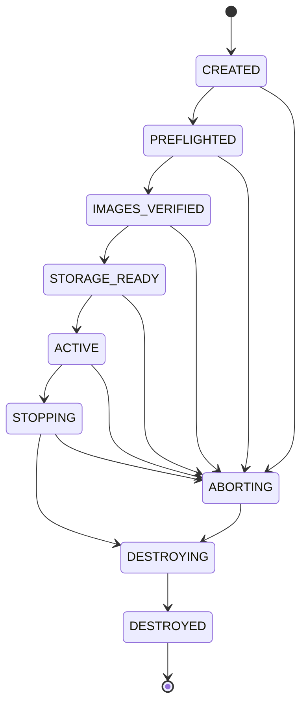

# State machines

## Session state



`DESTROYED` is reached only after an audit of remaining resources.

## Workstation workflow

```text
PLANNED
IMAGE_READY
STORAGE_READY
NETWORK_READY
VM_BOOTING
GUEST_AUTHENTICATED
VPN_CONFIGURED
VPN_VERIFIED
DISPLAY_READY
WORKING
EXPORT_REQUIRED | CLEAN
STOP_REQUESTED
OUTPUT_VERIFIED
VM_STOPPED
SESSION_DESTROYED
```

Stop rules:

| Workspace | Normal stop |
|---|---|
| CLEAN | allowed |
| READY | allowed |
| UNEXPORTED | blocked |
| CHANGED | blocked |
| UNREACHABLE | destructive confirmation required |

## Downloader workflow

```text
PLANNED
SCANNER_UPDATE_PREPARED
DOWNLOADER_BOOTING
GUEST_AUTHENTICATED
VPN_CONFIGURED
VPN_VERIFIED
METADATA_FETCHING
METADATA_READY
FILE_SELECTION_REQUIRED
CAPACITY_VERIFIED
DOWNLOADING
DOWNLOAD_PAUSED | DOWNLOAD_COMPLETE
DOWNLOADER_STOPPED
QUARANTINE_SEALED
```

Payload cannot start before `CAPACITY_VERIFIED`.

## Scanner workflow

```text
UPDATE_VM_BOOTING
DEFINITIONS_UPDATING
DEFINITIONS_VERIFIED
UPDATE_VM_STOPPED
SCAN_VM_BOOTING_OFFLINE
OFFLINE_VERIFIED
QUARANTINE_ATTACHED_READ_ONLY
INVENTORY_COMPLETE
MALWARE_SCAN_COMPLETE
RECONSTRUCTION_COMPLETE
REPORT_COMPLETE
POLICY_APPROVED | POLICY_REJECTED
SCAN_VM_STOPPED
```

Any of these force `POLICY_REJECTED`:

- ClamAV detection
- scan error
- skipped relevant file
- limit hit
- stale/unavailable definitions
- network device present
- writable quarantine
- uninspectable encrypted content
- unsupported type under safe policy
- output/hash mismatch

## Exporter workflow

```text
PLANNED
USB_IDENTIFIED
USB_CLAIMED
EXPORTER_BOOTING
GUEST_AUTHENTICATED
NO_NETWORK_VERIFIED
USB_ATTACHED
DESTINATION_PREPARED
STREAMING
STREAM_COMPLETE
FLUSHED
POST_WRITE_VERIFIED
USB_UNMOUNTED
USB_DETACHED
EXPORTER_STOPPED
```

## Event model

Every transition emits an event with:

- monotonic sequence number
- session ID
- state
- stable event code
- safe human message
- timestamp
- progress fields where applicable
- no sensitive filename by default
- optional redacted display label

The event stream is replayable only for the lifetime of the session and is kept
under `/run`.

## Cancellation

Cancellation is accepted in every nonterminal state. The orchestrator maps it to
`ABORTING`; it never jumps directly to process kill without resource cleanup.

## Idempotency

All cleanup functions return success if the target is already absent. Repeated
`abort` or daemon startup recovery must converge on `DESTROYED`.
