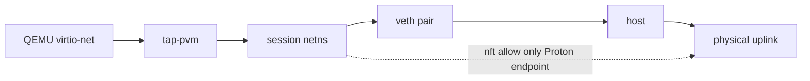

# Networking and Proton VPN

## VPN input

The user supplies a Proton WireGuard configuration generated through Proton's
account interface. `private-vm` does not authenticate to Proton's account API and
does not store the user's Proton account password.

The parser accepts only the required WireGuard fields and rejects:

- hooks such as `PreUp`, `PostUp`, `PreDown`, `PostDown`
- multiple peers
- non-default routes that weaken policy
- missing IPv4 default route
- IPv6 enabled without `::/0`
- endpoint without a concrete port
- invalid keys or addresses
- unsafe DNS values
- duplicate fields
- IPv4-mapped IPv6 addresses and zoned addresses

The endpoint hostname is resolved on the trusted host before creating the guest.
The ephemeral guest copy uses an IP address to avoid pre-tunnel DNS.

### Frozen v1 profile grammar

The bounded parser accepts UTF-8 input of at most 64 KiB and 256 lines. Blank
lines and full-line `#` comments are allowed. The only sections, in order, are
one `[Interface]` and one `[Peer]`; duplicate sections and fields fail closed.
The exact fields are:

| Section | Required fields |
|---|---|
| `Interface` | `PrivateKey`, `Address`, `DNS` |
| `Peer` | `PublicKey`, `AllowedIPs`, `Endpoint` |

Keys are strict padded base64 encodings of exactly 32 nonzero bytes. Interface
addresses must be unicast IPv4 `/32` or IPv6 `/128`, with at least one IPv4
address. DNS entries are literal global-unicast addresses—private tunnel
addresses are valid, while hostnames, loopback, link-local, multicast and
unspecified addresses are rejected. At most eight interface and eight DNS
addresses are accepted.

Tunnel interface and DNS address policy is distinct from endpoint policy:
RFC1918 and ULA values are permitted inside the tunnel, but CGNAT,
documentation, benchmarking, transition, link-local, loopback, multicast and
other special-use ranges are rejected. IPv4-mapped IPv6 input is rejected
before any normalization, including when it embeds an otherwise public IPv4
address.

`AllowedIPs` is exactly `0.0.0.0/0`, optionally followed by `::/0`; partial,
additional and duplicate routes are rejected. Any IPv6 interface or DNS address
requires `::/0`. Endpoint ports are numeric and nonzero. Literal endpoints must
be public unicast addresses. Hostnames use bounded ASCII DNS-label syntax and
reject single-label, localhost, `.local` and `.internal` names. Inline hooks,
`MTU`, `PersistentKeepalive` and every other unlisted field are rejected rather
than interpreted.

### Volatile profile lifecycle and rotation

The normal import path first uses the CLI's bounded sensitive-input adapter,
then parses the resulting `secret.Bytes` inside the daemon. The private key is
decoded into a protected `secret.Bytes` mapping without a string conversion.
The daemon-lifetime memory store has no persistence or restore adapter and
admits at most eight names per owner and 64 total. Atomic
replacement destroys the old generation; remove and daemon shutdown are
idempotent and destroy all owned keys.

Inspection is intentionally aggregate-only. It exposes the schema version,
presence, owner-local opaque generation, IPv4/IPv6 enablement, address/DNS
counts and one of
`not_imported`, `resolution_required`, `current` or `rotation_required`. It
never exposes keys, endpoints, addresses, DNS values, source paths or times.
The state becomes `current` only after trusted-host endpoint resolution succeeds.
A stale, unsafe, empty, oversized or failed result sets `rotation_required` and
returns `VPN_ENDPOINT_UNRESOLVED` with remediation to generate a current Proton
profile. Every resolution attempt invalidates the prior plan before DNS starts.
Caller cancellation therefore leaves that generation in `resolution_required`;
an unsafe or failed answer requires rotation.

Trusted-host resolution uses the configured hostname as an absolute DNS name,
has a hard ten-second ceiling, accepts no more than 16 answers and requires
every answer to pass the explicit reviewed public-endpoint range policy. Results
are deduplicated and sorted. Wrapped resolver errors and returned addresses are
not logged. Resolution occurs outside the store lock; production `net.Resolver`
honors the context ceiling, while a test adapter that violates it can block only
its own caller and cannot block import, remove, close or daemon shutdown.

The result is sealed into an opaque plan bound to the exact owner, profile name,
generation, resolution epoch, endpoint set and port. The same current plan must
be consumed for host firewall endpoints and guest configuration; cross-owner,
cross-name, stale and substituted handles fail closed. Its resolved view is
scope-bound to the `UsePlan` callback, so retaining it cannot extend the plan's
lifetime. Invalidation also clears the plan's owned endpoint set. Endpoint and
configuration-reader diagnostic formatting is redacted and serialization is
rejected. The endpoint hostname is
replaced by the selected IP, the encoded private key is never represented as a
Go string, and the callback buffer is cleared on return. This explicit
destruction reduces exposure but is not a perfect-erasure claim.

## Host namespace topology

Use static guest addressing. Do not run a broad DNS/DHCP service.

### Host implementation contract

For each session, the daemon deterministically allocates two non-overlapping
IPv4 `/30` networks within `10.240.0.0/13` and two IPv6 `/126` networks below
`fd70:766d::/32`. One pair connects the guest to its TAP gateway and the other
connects the namespace veth to the host. Allocation tries at most 64
session-derived slots, rejects any overlapping non-default host route, checks
exact namespace, root-link and nftables inventories, and reserves both the
chosen address slot and derived-name set before any mutation. Linux interface
names never exceed 15 bytes. DHCP, host DNS forwarding and a shared bridge are
not created.

The TAP is created with `IFF_TAP|IFF_NO_PI`, its descriptor is retained, and the
named interface is moved into the session namespace before readiness. QEMU may
receive only a scoped duplicate through an inherited file descriptor; it never
receives the TAP or namespace name. The QEMU process owner stops the child
before network cleanup.

The namespace owns an nftables table whose policy:

- default drop
- permit established/related
- permit required link-local/ARP
- permit guest UDP only to resolved Proton endpoint and port
- deny host LAN/private ranges
- deny all other IPv4/IPv6
- no inbound forwarding

The host owns a separate uniquely named nftables table. Its forward hook leaves
unrelated host traffic unchanged, but for the session veth it accepts only:

- exact guest source address to an `(endpoint IP, UDP port)` in the current
  opaque Proton resolution plan; and
- established/related return traffic whose destination is the exact guest
  address.

Every other packet entering or leaving that veth is dropped. NAT masquerading
also requires the exact guest source and Proton destination tuple for IPv4 and
IPv6. This makes public, LAN, metadata, direct DNS and source-spoof paths fail
closed without maintaining a weaker range blacklist. The namespace table uses
the same exact source/destination checks with default-drop input, output and
forward chains. Both complete tables are atomic `nft -f -` transactions before
the network becomes ready. Endpoint values never appear in argv or environment
and never leave the adapter through returned errors, status or captured output;
the transient stdin rule buffer is cleared after every result.

Provisioning, TAP/configuration handoffs and cleanup have one serialized
lifecycle owner. Once cleanup is accepted it continues in an independent
bounded context even if the initiating client disconnects. It first disables
and deletes the host veth to sever egress, then removes both nftables tables,
the TAP and namespace. Every operation first uses a successful exact inventory;
exit status `1` is not treated as absence. Attempt markers remain set across
partial failures so a retry revisits every possibly allocated resource, and the
address reservation is released only after the final exact absence audit.

`NET-003` remains the separate guest boundary: installation of the guest
kill-switch, WireGuard activation, handshake/leak tests, tunnel-loss response
and orchestrator/QEMU start ordering are not implied by host-network readiness.

## Guest policy

The guest has two zones:

### Underlay `eth0`

Allowed:

- ARP/neighbor discovery for gateway
- UDP to exact Proton endpoint

Denied:

- DNS
- HTTP/HTTPS
- LAN
- all other addresses and ports

### Tunnel `proton0`

Allowed according to role:

- workstation: normal outbound traffic
- downloader: normal outbound traffic, with qBittorrent bound to `proton0`
- scanner update: ClamAV update endpoints only if endpoint allowlisting is
  practical; otherwise general tunnel egress during update boot
- scan/exporter: interface absent

## qBittorrent

Use qBittorrent Web API controlled locally by guestd. The graphical client may
be present, but guestd is authoritative for:

- add paused
- metadata status
- file selection
- save path
- start/pause
- progress
- completion
- interface binding verification

Required settings:

- network interface `proton0`
- anonymous mode where supported
- DHT/PEX/LSD policy configurable
- UPnP disabled
- NAT-PMP disabled by default
- no automatic execution
- no watched folders
- no external program hooks
- no alternate upload directory outside quarantine
- no web API listener beyond localhost

Port forwarding is not part of v1. Download functionality does not require it,
and it adds state and inbound exposure.

The downloader image boots with a default-drop `inet` table. It contains
separate IPv4 and IPv6 runtime templates whose only underlay egress is UDP to a
typed, validated Proton endpoint; NET-003 renders and applies one complete
transaction after profile validation. qBittorrent runs as a hardened user
service only when both the root-owned `/run/private-vm-vpn/ready` marker and the
quarantine mount exist. Its profile and logs are volatile, its Web API binds to
`127.0.0.1`, and the immutable image contains no reusable API credential.
TOR-002 must provision and verify local authentication with a per-boot
credential before guestd uses the API.

NIX-004 establishes only the fail-closed image defaults and service sandbox. It
does not claim that the current immutable `ExecStartPre` profile copy provisions
an authenticated Web API session. TOR-002 must replace that bootstrap path with
a bounded per-boot credential flow, keep the credential in volatile memory,
prove an authenticated API request succeeds, and prove the credential is absent
from argv, the environment, the immutable profile and the journal.

## Leak tests

Before role readiness:

1. WireGuard handshake timestamp is recent.
2. `proton0` exists and has expected routes.
3. tunnel DNS resolves.
4. public IPv4 through tunnel is reachable.
5. public IPv6 through tunnel is reachable when enabled.
6. a direct socket bound to `eth0` cannot reach a public test endpoint.
7. DNS bound to `eth0` fails.
8. qBittorrent reports `proton0` as bound interface.
9. host namespace counters show no forbidden egress.

Tests must avoid sending secrets or torrent metadata to third-party leak-test
sites. Use minimal controlled endpoints or Proton-provided IP checks.

## VPN loss

guestd continuously monitors:

- interface existence
- latest handshake
- default route
- DNS route

On failure:

- guest nftables already blocks fallback
- qBittorrent is paused
- workstation shows a blocking warning
- daemon emits `VPN_DEGRADED`
- session remains available for local save/export
- user may retry or stop
